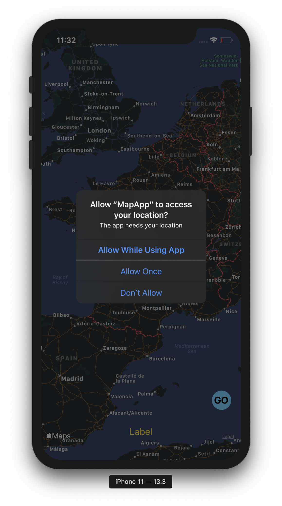
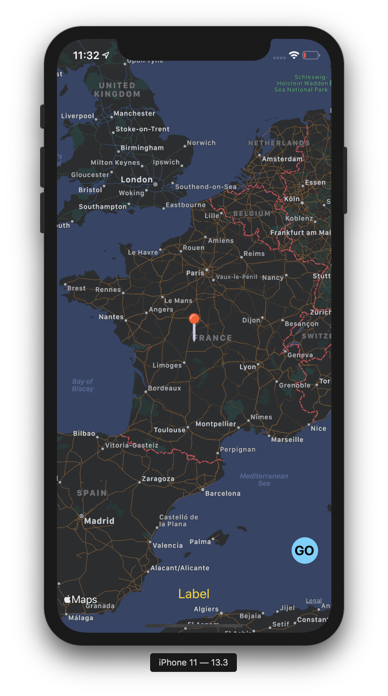
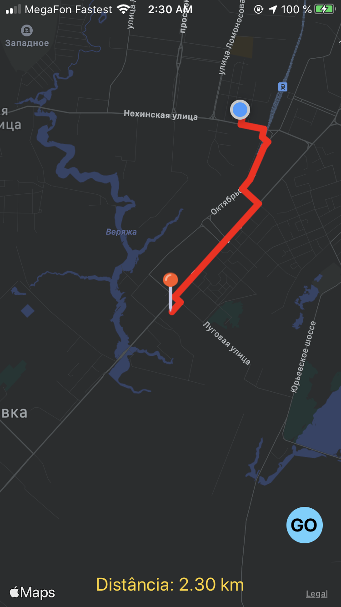
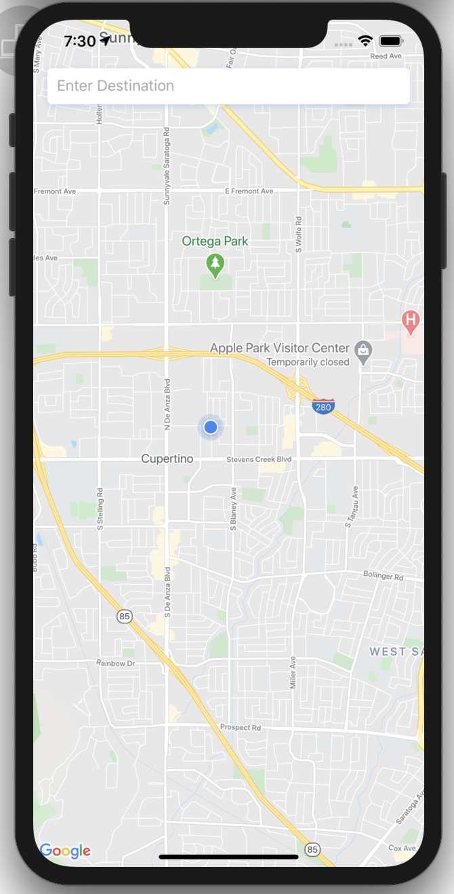
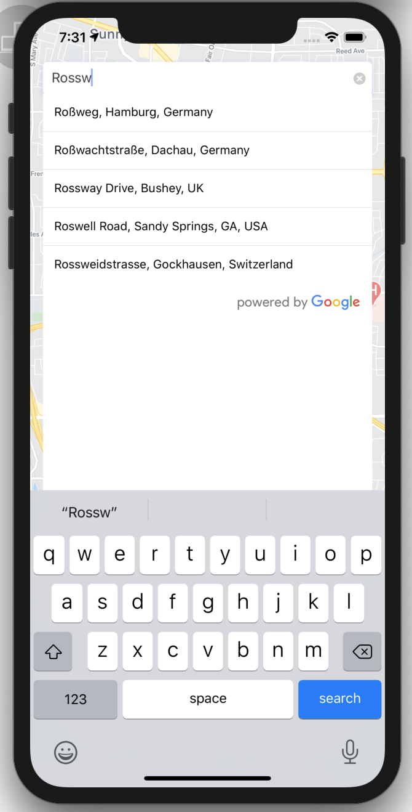
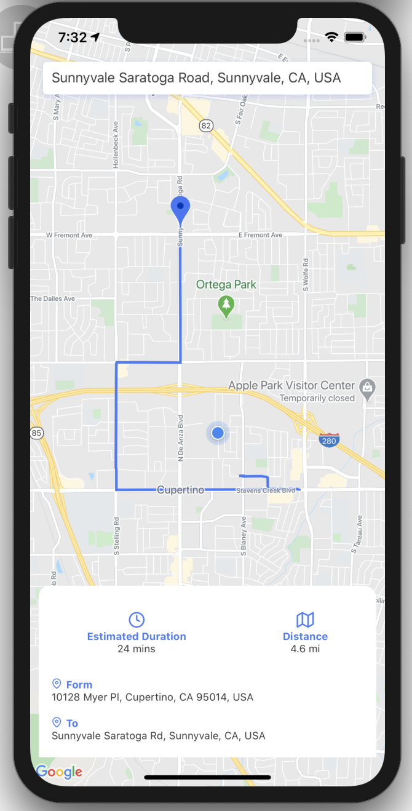

 <h2 align="center">Mobile App - Maps Coding Challenge</h2>

 
 
### Challenge:

Criar uma App que use mapa e consiga calcular a distância entre dois pontos (A to B) e de seguida mostrar os resultados ao usuário e  mostra o percurso entre os pontos ao usuário.

### Soluções
- [Swift](/Swift) by @marcoswmv

  
  
  

- [Expo (RN)](/rn-expo-map) by @brunokiafuka

  
  
  

